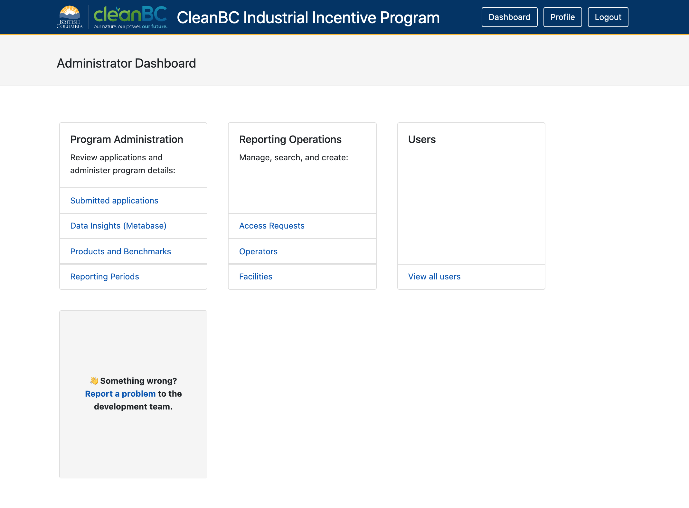
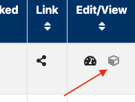
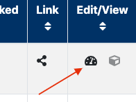
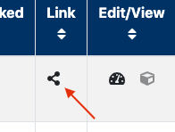
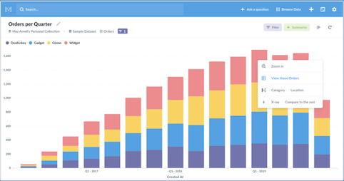

### The CIIP Dashboard

The Dashboard is a central overview page giving access to all the main tools the business will need to manage their application details. (Note: Depending on your permission level, some of the tools may or may not be visible.)

#### User Management

You can view all user information here including their name, occupation, and contact details.

To grant or revoke access to an IDIR user, a Keycloak Realm admin must first log in to the administration console to make those adjustments.

#### Application Management

All applications, organizations and access requests, and facilities are managed here.

##### Organizations and Facilities

The GHG Regulator can add a new facility or organisation here by searching for an existing one or adding a new one. Note, however, that manually adding an organisation or facility via these pages has the potential to create duplicate and SWRS-orphaned organisations and facilities in the data.

#### Program and Data Management

##### Products

Access, create and edit each product for your facilities from this area. On the product table, the box icon at the far right is for editing or viewing products, with a greyed out icon indicating that the product is already approved (and therefore uneditable).

##### Benchmarks

Greenhouse gas (GHG) emissions benchmarks include items such as the start end end reporting years, eligibility thresholds and the incentive multipliers needed to calculate emissions accurately. On the product table, the benchmarks are identified by the dial icon.

##### Product Association Linking

The use of a product may invariably involve the use of another product. In order to report on the emissions of these, it is advisable to link them to ensure related items are fully accountable. Further instructions for how to create or edit these associations is displayed on the pop-up page 'Product Associations', found by clicking the icon illustrated below.

##### Reporting Periods

This list is a reference for past and future (up to two years) reporting periods and may be editable depending on your role and permissions.

##### Data and Insights

A visual data table of metrics provided by [Metabase](https://www.metabase.com/) is available to internal BC Government users, which can allow for easy access to see, for example, which products are emitting the highest emissions of a certain type. Clicking this link will take you to an external but secure site to access the BC Government's managed instance of Metabase.

