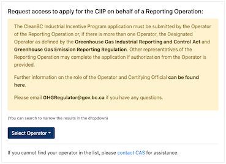
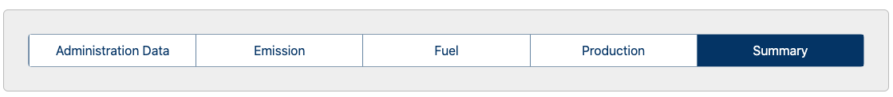
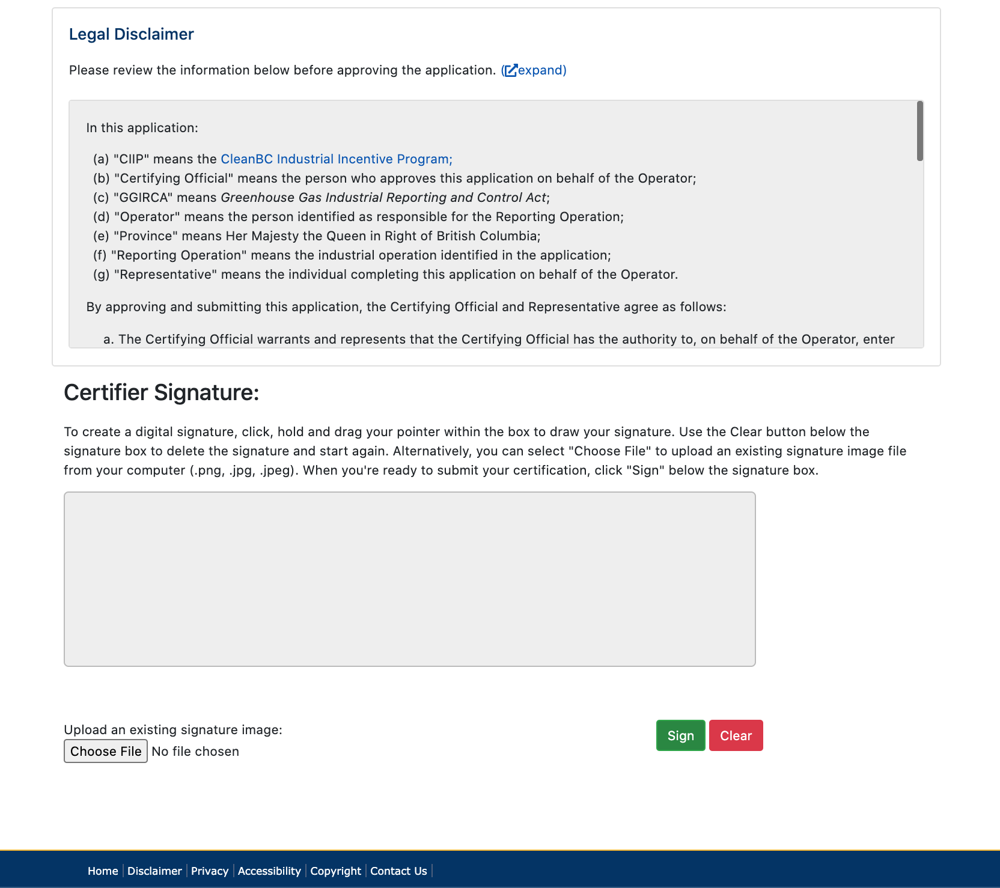
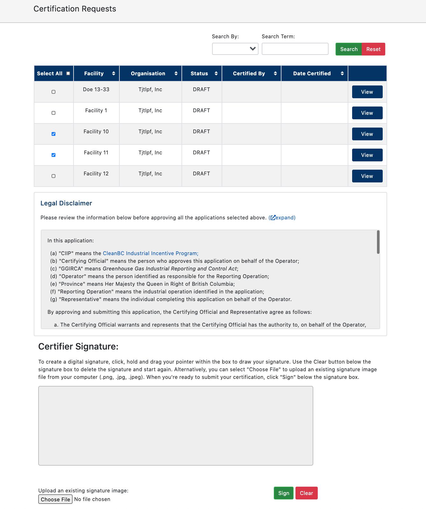

&nbsp;

&nbsp;

# CleanBC Industrial Incentive Program (CIIP) Reporting -  Basic Information

This document is for users of the [CIIP Reporting Application Portal](https://ciip.gov.bc.ca/ ) and summarizes information from a number of sources including:

- [CleanBC Industrial Incentive Program webpage](https://www2.gov.bc.ca/gov/content?id=6F748A4DD83447C59B8B9361882FF9A3) (includes webinar slides, product-specific benchmarks and thresholds, and sector eligibility).
- [BC Government's Reporting Industrial Greenhouse Gas Emissions webpage](https://www2.gov.bc.ca/gov/content/environment/climate-change/industry/reporting) (includes important dates, links to related information).
- [BC Greenhouse Gas Industrial Reporting and Control Act, [Sbc 2014] Chapter 29](https://www.bclaws.ca/civix/document/id/complete/statreg/14029_01) (includes definitions, compliance obligations, etc).

## What is CIIP?

'CIIP' stands for the CleanBC Industrial Incentive Program which supports emissions reductions and industrial competitiveness by providing incentives for cleaner industrial operations that meet a world-leading low-carbon emissions benchmark. The level of incentive payment is based on the performance of each industrial operation.

More information on the CIIP, including details on the items below, is available on the [CleanBC Industrial Incentive Program webpage](https://www2.gov.bc.ca/gov/content?id=6F748A4DD83447C59B8B9361882FF9A3) which we recommend you have handy in another browser tab/window.

## Who is eligible?

The CleanBC Industrial Incentive Program is open to businesses that emit more than 10,000 tonnes of carbon dioxide equivalent (CO2e) per year and/or those that report under the Greenhouse Gas Industrial Reporting and Control Act that have taken all reasonable measures to comply with the requirements under the Act. Additionally the business does not operate in a sector listed as being ineligible in the Sector Eligibility table listed on the [CleanBC Industrial Incentive Program webpage](https://www2.gov.bc.ca/gov/content?id=6F748A4DD83447C59B8B9361882FF9A3).

## Who can submit the CIIP application?

The CleanBC Industrial Incentive Program application must be submitted by the **Operator of the Reporting Operation** or, if there is more than one Operator, the Designated Operator as defined by the Greenhouse Gas Industrial Reporting and Control Act and Greenhouse Gas Emission Reporting Regulation. Other representatives of the Reporting Operation may complete the application if authorization from the Operator is provided.

## How to Apply to CIIP

Before applying, you must submit your GHG emission report through the [Single Window Reporting System](https://ec.ss.ec.gc.ca/en/cs). After that you can submit your CIIP application through the [online CIIP application portal](https://ciip.gov.bc.ca/). Key dates for these steps are listed on the [portal's homepage](https://ciip.gov.bc.ca/).

For additional guidance materials on quantifying facility emissions and production volumes, or for other application requirements, please email [GHGregulator@gov.bc.ca](mailto:GHGregulator@gov.bc.ca).

## Roles and permissions

### The Operational Representative:

- **Has permissions to:** Fill in an application.
- **Is defined as:**
  1. in the case of a single operator of an industrial operation,
     1. if the operator of the industrial operation is an individual, the operator
     2. if the operator of the industrial operation is a corporation
        1. a senior officer of the corporation, or
        2. the individual with primary responsibility for the operations and management of the industrial operation, or
     3. if the operator of the industrial operation is not an individual or a corporation, the individual with primary responsibility for the operations and management of the industrial operation, and
  2. in the case of multiple operators,
     1. an individual who has been authorized in writing by all the operators to act as the operation representative, or
     2. if subparagraph (i) does not apply, an individual who has been authorized in writing to act as the operation representative by the operator.

### The Certifying Official:

- **Has permissions to:** Certify an application.
- **Is defined as:**
  1. the person who approves this application on behalf of the Operator. The Certifying Official warrants and represents that the Certifying Official has the authority to, on behalf of the Operator, enter into the following terms and provide the following consents and certifications for the CIIP.

# The CIIP Application Portal

As of July 16, 2020, the CIIP Reporting Application Portal is available at https://ciip.gov.bc.ca/

While you are in the system, it will save your live (as you type) form data continually, facilitating the ability to move freely around the form tabs as needed without losing entered data. After a period of inactivity, the system will log you out for security purposes.

### How to Register

Before you can apply for the CIIP on behalf of an eligible operation, you must [register with the Ministry of Environment and Climate Change Strategy](https://ciip.gov.bc.ca/register).

For more information please see the [CleanBC Industrial Incentive Program webpage](https://www2.gov.bc.ca/gov/content?id=6F748A4DD83447C59B8B9361882FF9A3).

### How to Login

There is a two step process for utilizing the CIIP Application at https://ciip.gov.bc.ca/. At the top of the page you will see two buttons:

 

1. **Register** - From the 'Register' button, fill in the required fields and be sure to create a password with a minimum length of 8 characters.
2. **Log in** - From the 'Log in' button, enter your username and password. CAS users should use the IDIR to login.

At the top of the screen of the CIIP homepage, click to complete these steps.

### How to Request Access to an Operation

Once admitted into the application, you'll be first asked to verify some of your details (e.g., phone number, occupation).

Next, on your Dashboard, request access to apply for the CIIP on behalf of a Reporting Operation. The CIIP team will verify and approve your request as appriopriate.

 If approved, you can click on 'View Facilities' button to see its details and apply for CIIP for a given facility.

### Filling in Form Data on the Application

As noted at the top of this document, there is an auto-save feature always active on the CIIP web application, which saves your data every few seconds in order to prevent any loss of information. Additionally, the system will log you out after a period of inactivity.

As various roles associated with an organization can access the same form, and as information entered is saved on a regular basis, multiple people can work on the form concurrently. Changes made to the form during shared access are reflected respectively for each user, allowing for a rapid and collaborative workflow.

#### Multi-Tab Form

The CIIP application is a multi-tab form that is made of five different sections.

Each page provides a:

link at the top right in case there are any issues preventing the reporter from filling in accurate information. A comment box is provided to detail a message, which the Climate Action Secretariat may follow up for further clarification.

At the bottom of each screen you will find a Continue and/or Back button, but you can freely move between sections as needed, namely:

1. **Administration Data** - All fields in this form are required before you can submit the form for review.
2. **Emission** - Details on various emission processes are provided for calculating the tonnes of CO2e.
3. **Fuel** - Add a new fuel or remove an existing one for your facility. Pay special attention to units to ensure accuracy. All fields in this form are required.
4. **Production** - Add a new product or service, or remove an existing one from your facility.
5. **Summary** - This page will display any errors that must be fixed before submission. Additionally, a Download button at the bottom of the page allows you to save a PDF copy of the application as-is.

   Once all errors have been corrected, you can submit the application and include any comments necessary. At any time you can [contact CAS](mailto:ghgregulator@gov.bc.ca) for assistance.

## How to approve an application for submission as a Certifying Official

You may receive an email certification request on behalf of an Operation Representative applying for CIIP for a given Reporting Operation. Each Reporting Operation will have its own application, each of which must be approved by a Certifying Official before it can finally be submitted.

As a Certifying Official, you will first need to register for an account on the [CIIP application website](https://ciip.gov.bc.ca), which you can do when visiting the link in the certification request email. If you already have an account, you may simply log in.

By visiting the link in the certification request email, you can review the data that will be submitted in the CIIP application for the Reporting Operation and ensure that you are ready to approve the application. After reviewing the [terms](https://ciip.gov.bc.ca/resources/application-disclaimer) at the bottom of the application summary, you can agree to the terms and approve the application for submission by adding your digital signature and clicking "Sign".

To create a digital signature, click, hold and drag your pointer within the box at the bottom of the application summary to draw your signature. Use the Clear button below the signature box to delete the signature and start again. Alternatively, you can select "Choose File" to upload an existing signature image file from your computer (.png, .jpg, .jpeg). When you're ready to submit your certification, click "Sign" below the signature box to approve the application for submission. The Operation Representative who made the application will be automatically notified of your signature so they may submit the application.

You may review a list of certification requests, including a record of applications you've certified, via the ["View all certification requests"](https://ciip.gov.bc.ca/certifier/requests) link at the top of the [site dashboard](https://ciip.gov.bc.ca/reporter). This list is searchable by facility, organisation, and certification details. If you have many similar applications to certify, you can certify multiple applications at once by selecting them and using the signature interface that will appear on the page beneath.

 **Note**: By certifying multiple applications in this manner, you agree to the same [terms](https://ciip.gov.bc.ca/resources/application-disclaimer) noted above, indicating you are aware of the contents of the selected applications and, as the Certifying Official, are approving them for submission.

 