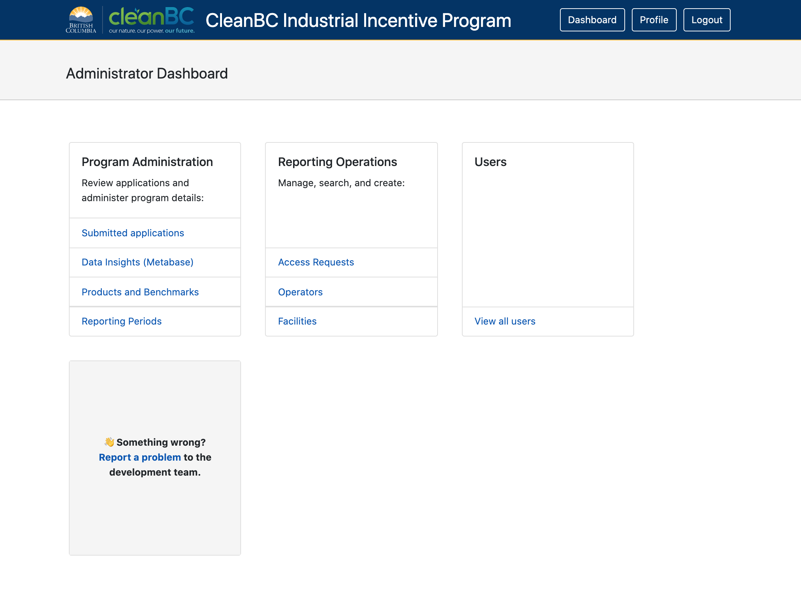

&nbsp;

&nbsp;

# CleanBC Industrial Incentive Program (CIIP) Reporting -  Basic Information

This document is for users of the [CIIP Reporting Application Portal](https://ciip.gov.bc.ca/ ) and summarizes information from a number of sources including:

- [CleanBC Industrial Incentive Program webpage](https://www2.gov.bc.ca/gov/content/environment/climate-change/industry/cleanbc-program-for-industry) (includes webinar slides, product-specific benchmarks and thresholds, and sector eligibility).
- [BC Government's Reporting Industrial Greenhouse Gas Emissions webpage](https://www2.gov.bc.ca/gov/content/environment/climate-change/industry/reporting) (includes important dates, links to related information).
- [BC Greenhouse Gas Industrial Reporting and Control Act, [Sbc 2014] Chapter 29](https://www.bclaws.ca/civix/document/id/complete/statreg/14029_01) (includes definitions, compliance obligations, etc).

## What is CIIP?

'CIIP' stands for the CleanBC Industrial Incentive Program which supports emissions reductions and industrial competitiveness by providing incentives for cleaner industrial operations that meet a world-leading low-carbon emissions benchmark. The level of incentive payment is based on the performance of each industrial operation.

More information on the CIIP, including details on the items below, is available on the [CleanBC Industrial Incentive Program webpage](https://www2.gov.bc.ca/gov/content/environment/climate-change/industry/cleanbc-program-for-industry) which we recommend you have handy in another browser tab/window.

## Who is eligible?

The CleanBC Industrial Incentive Program is open to businesses that emit more than 10,000 tonnes of carbon dioxide equivalent (CO2e) per year and/or those that report under the Greenhouse Gas Industrial Reporting and Control Act that have taken all reasonable measures to comply with the requirements under the Act. Additionally the business does not operate in a sector listed as being ineligible in the Sector Eligibility table listed on the [CleanBC Industrial Incentive Program webpage](https://www2.gov.bc.ca/gov/content/environment/climate-change/industry/cleanbc-program-for-industry).

## Who can submit the CIIP application?

The CleanBC Industrial Incentive Program application must be submitted by the **Operator of the Reporting Operation** or, if there is more than one Operator, the Designated Operator as defined by the Greenhouse Gas Industrial Reporting and Control Act and Greenhouse Gas Emission Reporting Regulation. Other representatives of the Reporting Operation may complete the application if authorization from the Operator is provided.

## How to Apply to CIIP

Before applying, you must submit your GHG emission report through the [Single Window Reporting System](https://ec.ss.ec.gc.ca/en/cs). After that you can submit your CIIP application through the [online CIIP application portal](https://ciip.gov.bc.ca/). Key dates for these steps are listed on the [portal's homepage](https://ciip.gov.bc.ca/).

For additional guidance materials on quantifying facility emissions and production volumes, or for other application requirements, please email [GHGregulator@gov.bc.ca](mailto:GHGregulator@gov.bc.ca).

## Roles and permissions

### The Operational Representative:

- **Has permissions to:** Fill in an application.
- **Is defined as:**
  1. in the case of a single operator of an industrial operation,
     1. if the operator of the industrial operation is an individual, the operator
     2. if the operator of the industrial operation is a corporation
        1. a senior officer of the corporation, or
        2. the individual with primary responsibility for the operations and management of the industrial operation, or
     3. if the operator of the industrial operation is not an individual or a corporation, the individual with primary responsibility for the operations and management of the industrial operation, and
  2. in the case of multiple operators,
     1. an individual who has been authorized in writing by all the operators to act as the operation representative, or
     2. if subparagraph (i) does not apply, an individual who has been authorized in writing to act as the operation representative by the operator.

### The Certifying Official:

- **Has permissions to: **Certify an application.
- **Is defined as:**
  1. the person who approves this application on behalf of the Operator. The Certifying Official warrants and represents that the Certifying Official has the authority to, on behalf of the Operator, enter into the following terms and provide the following consents and certifications for the CIIP.

# The CIIP Application Portal

As of July 16, 2020, the CIIP Reporting Application Portal is available at https://ciip.gov.bc.ca/

While you are in the system, it will save your live (as you type) form data continually, facilitating the ability to move freely around the form tabs as needed without losing entered data. After a period of inactivity, the system will log you out for security purposes.

### How to Register

Before you can apply for the CIIP on behalf of an eligible operation, you must [register with the Ministry of Environment and Climate Change Strategy](https://ciip.gov.bc.ca/register).

For more information please see the [CleanBC Industrial Incentive Program webpage](https://www2.gov.bc.ca/gov/content/environment/climate-change/industry/cleanbc-program-for-industry).

### How to Login

There is a two step process for utilizing the CIIP Application at https://ciip.gov.bc.ca/. At the top of the page you will see two buttons:

 

1. **Register** - From the 'Register' button, fill in the required fields and be sure to create a password with a minimum length of 8 characters.
2. **Log in** - From the 'Log in' button, enter your username and password. CAS users should use the IDIR to login.

At the top of the screen of the CIIP homepage, click to complete these steps.

### How to Request Access to an Operation

Once admitted into the application, you'll be first asked to verify some of your details (e.g., phone number, occupation).

Next, on your Dashboard, request access to apply for the CIIP on behalf of a Reporting Operation. The CIIP team will verify and approve your request as appriopriate.

 If approved, you can click on 'View Facilities' button to see its details and apply for CIIP for a given facility.

### The CIIP Dashboard

The Dashboard is a central overview page giving access to all the main tools the business will need to manage their application details. (Note: Depending on your permission level, some of the tools may or may not be visible.)

#### User Management

You can view all user information here including their name, occupation, and contact details.

To grant or revoke access to an IDIR user, a Keycloak Realm admin must first log in to the administration console to make those adjustments.

#### Application Management

All applications, organizations and access requests, and facilities are managed here.

##### Organizations and Facilities

The GHG Regulator can add a new facility or organisation here by searching for an existing one or adding a new one. Note, however, that manually adding an organisation or facility via these pages has the potential to create duplicate and SWRS-orphaned organisations and facilities in the data.

#### Program and Data Management

##### Products

Access, create and edit each product for your facilities from this area. On the product table, the box icon at the far right is for editing or viewing products, with a greyed out icon indicating that the product is already approved (and therefore uneditable).

##### Benchmarks

Greenhouse gas (GHG) emissions benchmarks include items such as the start end end reporting years, eligibility thresholds and the incentive multipliers needed to calculate emissions accurately. On the product table, the benchmarks are identified by the dial icon.

##### Product Association Linking

The use of a product may invariably involve the use of another product. In order to report on the emissions of these, it is advisable to link them to ensure related items are fully accountable. Further instructions for how to create or edit these associations is displayed on the pop-up page 'Product Associations', found by clicking the icon illustrated below.

##### Reporting Periods

This list is a reference for past and future (up to two years) reporting periods and may be editable depending on your role and permissions.

##### Data and Insights

A visual data table of metrics provided by [Metabase](https://www.metabase.com/) is available to internal BC Government users, which can allow for easy access to see, for example, which products are emitting the highest emissions of a certain type. Clicking this link will take you to an external but secure site to access the BC Government's managed instance of Metabase.

### Filling in Form Data on the Application

As noted at the top of this document, there is an auto-save feature always active on the CIIP web application, which saves your data every few seconds in order to prevent any loss of information. Additionally, the system will log you out after a period of inactivity.

As various roles associated with an organization can access the same form, and as information entered is saved on a regular basis, multiple people can work on the form concurrently. Changes made to the form during shared access are reflected respectively for each user, allowing for a rapid and collaborative workflow.

#### Multi-Tab Form

The CIIP application is a multi-tab form that is made of five different sections.

Each page provides a:

link at the top right in case there are any issues preventing the reporter from filling in accurate information. A comment box is provided to detail a message, which the Climate Action Secretariat may follow up for further clarification.

At the bottom of each screen you will find a Continue and/or Back button, but you can freely move between sections as needed, namely:

1. **Administration Data** - All fields in this form are required before you can submit the form for review.
2. **Emission** - Details on various emission processes are provided for calculating the tonnes of CO2e.
3. **Fuel** - Add a new fuel or remove an existing one for your facility. Pay special attention to units to ensure accuracy. All fields in this form are required.
4. **Production** - Add a new product or service, or remove an existing one from your facility.
5. **Summary** - This page will display any errors that must be fixed before submission. Additionally, a Download button at the bottom of the page allows you to save a PDF copy of the application as-is.

   Once all errors have been corrected, you can submit the application and include any comments necessary. At any time you can [contact CAS](mailto:ghgregulator@gov.bc.ca) for assistance.
